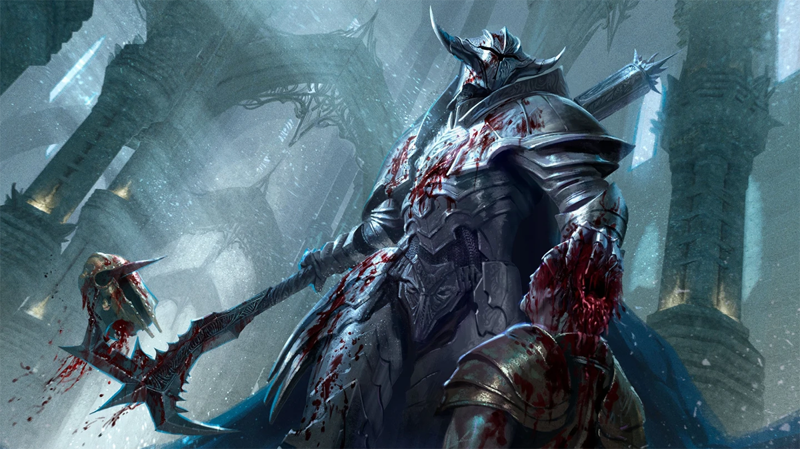
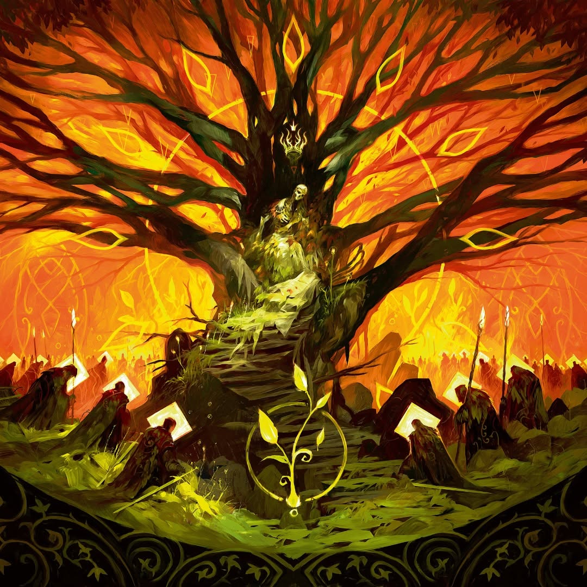

&emsp;&emsp;Flesh and Blood's pitch and resource [Resource](#fab-icon:resource) system proposes something unique: it simulates two people at their physical and tactical prime, fighting each other until one of them runs out of energy or blood.
 

Most decks in Flesh and Blood sit somewhere on a spectrum we'd loosely call midrange, though the word barely means anything once you actually apply it to this game. That's because of a single design choice sitting underneath everything else: almost every card in your hand is simultaneously your resource [Resource](#fab-icon:resource) base, your offense, and your defense. There's no split between "the stuff that lets you play spells" and "the spells themselves" the way there is in Magic and most other card games. Each card is all of it at once, and it only becomes one of those things the moment you actually commit it, which means every card sitting in your hand is being evaluated for three completely different jobs, constantly, until you're forced to pick.

That's what actually produces the question everyone in Flesh and Blood should be asking themselves every turn: Who is the beatdown right now?

It's worth noting that's not even an original Flesh and Blood question: it's lifted, word for word, from a much older piece of Magic strategy theory, Mike Flores' `_`Who's the Beatdown?`_`, about figuring out whether you're the aggressor or the control deck in a given matchup. But in Magic, that's usually a role you determine once, early, and it holds for most of the game. Your deck is built to be one or the other, and the matchup mostly tells you which.

Flesh and Blood asks the same question, but it doesn't let you answer it once. Because your hand is pitch, attack, and defense at the same time, the answer can flip mid-turn cycle, and it's being recalculated constantly rather than settled at the start of the game. Am I aggressive this turn, or defensive? The turn cycle makes that choice literal, not abstract: you only draw back up to your hero's intellect at the end of your own turn, thus committing to an aggressive stance requires you to allow your opponent to hit you, with no guarantee your swing back will actually land. Go on the defensive, and you're assuming a passive stance, handing your opponent the ability to dictate the tempo of the game. Is it worth taking my skull cracked open now so I can have a stronger swing later? If I block with my power cards, I've protected my Life [Life](#fab-icon:life) total, but I might not have them when I actually need to close the game. But if I don't block, I'm conceding an absurd amount of value.

None of those answers stay true for long. The powerful reds in your hand might suddenly be worth pitching for resources instead of playing or blocking, even though that's technically an inefficient use of a card that strong, because what you actually need this turn is fuel, not face value. Other times it runs the opposite way: a card that would be perfectly fine to play right now gets held back on purpose, saved for a turn down the line where the exact same card stops being merely good and becomes devastating.

You are, essentially, re-drafting your hand's job description every single turn, in real time, against someone doing the exact same thing to you: attacking, defending, or setting up to do either next.

~~Unless you're playing Cindra. If you're playing Cindra, please do take offense.~~

Despite doing so instinctively all along, a few months ago I got into a situation that forced me to address the question of who is the beatdown consciously for the first time in a Flesh and Blood game. I somehow found myself in the finals match of a Road to Nationals Event. I was playing [Verdance](#fab-card:verdance-thorn-of-the-rose@ROS013) , my all-time favorite hero, against the other finalist, playing [Dash I/O](#fab-card:dash-i-o). The standard plan against Dash is to fatigue her out: her aggression is balanced around the risk of fatiguing herself first, which usually shoehorses her as the beatdown and Verdance  the control deck by matchup theory alone.

A few turns in, that plan stopped making sense. My opponent's 80 was clearly put together to survive a long game, and when he played a [Prismatic Lens](#fab-card:prismatic-lens-yellow), a card I actually had to stop and read, I realized fatigue would only delay the loss, not prevent it. So I pivoted to an all-in aggressive stance, the last thing I expected to do with this deck.

His deck ran heavy on items to support that plan, which meant he couldn't block efficiently. Once he dropped to 16[Life](#fab-icon:life) , I stopped considering value at all and started playing to end the game before he could. On his next turn I watched my Life [Life](#fab-icon:life) total diminish from full to barely nothing while holding a full grip of four. I came back with [Channel the Millennium Tree](#fab-card:channel-the-millennium-tree-red) into [Waning Moon](#fab-card:waning-moon) into [Felling of the Crown](#fab-card:felling-of-the-crown-red), dropping him to 3 [Life](#fab-icon:life).  It wasn't the safest or the most efficient use of those cards, I'd have gotten more out of them by simply blocking, but by then the only math that mattered was the one that ended the game. Any spell left in my subsequent hand would have finished him. As it happened, and somewhat ironically, I only had one.

[Storm Striders](#fab-card:storm-striders@ARC116) into [Arcane Twining](#fab-card:arcane-twining-blue) into [Waning Moon](#fab-card:waning-moon) did the job at the last possible second.

I walked into that match with a role already decided. My opponent's deck was built specifically to punish the conventional gameplan. Dash's attempt to force through an unstoppable threat made her the control deck. My need to answer it made me the beatdown.

Answering "who's the beatdown" well, turn after turn, isn't just a read on the Life [Life](#fab-icon:life) totals. It's a read on the cards themselves, and the best way of converting what your hero's intellect has granted you for the turn cycle, and ultimately into the whole game itself. You can't correctly decide whether to swing, block, or hold back if you don't already know what each card in your hand is actually worth in the first place.

***

_This is the first piece in a series on how to actually evaluate a Flesh and Blood card. Next: The Anatomy of a Flesh and Blood Card, Part 1: Rate & Breakpoints._
